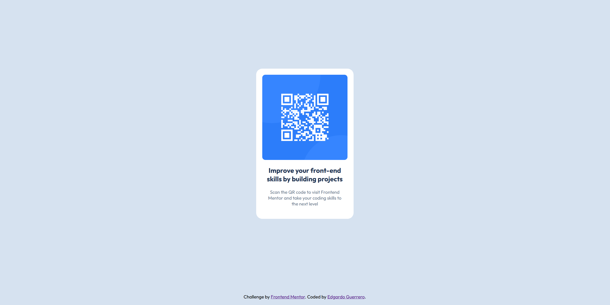

# Frontend Mentor - QR Code Component Solution

Esta es mi solución al [reto del componente de código QR en Frontend Mentor](https://www.frontendmentor.io/challenges/qr-code-component-iux_sIO_H). 

## Información del proyecto

### El reto
Los usuarios deben ser capaces de:
- Ver el diseño óptimo para el componente dependiendo del tamaño de pantalla de su dispositivo (Responsivo desde 320px hasta pantallas de escritorio).

### Captura de pantalla

### Enlaces
- URL del Repositorio: [https://github.com/EdgardoGuerrero/frontend-mentor-challenges](https://github.com/EdgardoGuerrero/frontend-mentor-challenges)
- URL del Sitio Web Vivo: [https://edgardoguerrero.github.io/frontend-mentor-challenges/qr-code-component-main/](https://edgardoguerrero.github.io/frontend-mentor-challenges/qr-code-component-main/)

## Mi proceso

### Tecnologías utilizadas
- Marcado HTML5 semántico
- Propiedades personalizadas de CSS (Variables/Colores HSL)
- Flexbox (Diseño de caja flexible)
- Enfoque Mobile-first

### Qué aprendí
En este reto practiqué la estructura semántica de HTML usando etiquetas como `<main>` y `<footer>`. También reforcé el uso de Flexbox para lograr un centrado perfecto tanto vertical como horizontal, y cómo estructurar un footer pegajoso (*sticky footer*) usando `min-height: 100vh` en el `body`.

## Autor
- GitHub - [@EdgardoGuerrero](https://github.com/EdgardoGuerrero)
- Frontend Mentor - [@EdgardoGuerrero](https://www.frontendmentor.io/profile/EdgardoGuerrero)