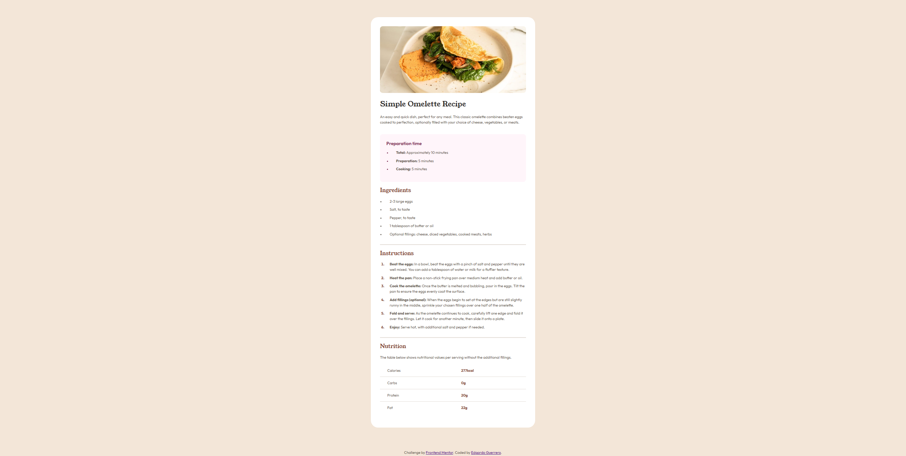

# Frontend Mentor - Solución para la página de recetas (Recipe page)

Esta es una solución al [reto de la página de recetas en Frontend Mentor](https://www.frontendmentor.io/challenges/recipe-page-Ki5UXg9ZbB). Los retos de Frontend Mentor te ayudan a mejorar tus habilidades en desarrollo frontend construyendo proyectos realistas.

## Índice

- [Resumen](#resumen)
  - [El reto](#el-reto)
  - [Captura de pantalla](#captura-de-pantalla)
  - [Enlaces](#enlaces)
- [Mi proceso](#mi-proceso)
  - [Construido con](#construido-con)
  - [Lo que aprendí](#lo-que-aprendí)
- [Autor](#autor)

## Resumen

### El reto

El objetivo de este reto era construir una página de recetas completamente responsiva y lograr que se vea lo más cercana posible al diseño original utilizando HTML y CSS limpios.

### Captura de pantalla



### Enlaces

- URL de la solución: [https://github.com/EdgardoGuerrero/frontend-mentor-challenges/recipe-page-main/](https://github.com/EdgardoGuerrero/frontend-mentor-challenges/recipe-page-main/)
- URL del sitio en vivo: [https://edgardoguerrero.github.io/frontend-mentor-challenges/recipe-page-main/](https://edgardoguerrero.github.io/frontend-mentor-challenges/recipe-page-main/)

## Mi proceso

### Construido con

- Marcado HTML5 semántico (`<article>`, `<section>`, `<table>`)
- Propiedades personalizadas de CSS (Variables para colores y fuentes)
- Flexbox para la alineación y la estructura del diseño vertical
- Estructura de flujo de trabajo enfocada en responsive design
- Selectores modernos de CSS (`::marker`, `:last-child`)

### Lo que aprendí

Este reto fue el cierre perfecto para este path de aprendizaje. Logré aplicar comentarios cruciales de reportes automáticos anteriores para elevar la calidad de mi código:

1. **Accesibilidad y Unidades Relativas:** Evité por completo el uso de unidades absolutas (`px`) para los tamaños de fuente y espaciados. En su lugar, utilicé `rem` para garantizar que el diseño se escale correctamente si un usuario cambia la configuración de su navegador.
2. **Propiedades Lógicas:** Implementé propiedades modernas como `padding-inline-start`, `margin-block-end` y `border-block-end` para asegurar una mejor internacionalización y limpieza en el código.
3. **Personalización de Tablas y Listas:** Aprendí cómo estilizar los bordes dentro de una `<table>` aplicando `border-collapse: collapse` en el elemento padre, y cómo personalizar los marcadores de lista por defecto usando `::marker` sin romper la estructura semántica.

Aquí hay un fragmento del truco de los bordes de la tabla del cual estoy orgulloso:
```css
.recipe-nutrition-table {
  width: 100%;
  border-collapse: collapse; /* Une los bordes de las celdas de forma limpia */
}

.recipe-nutrition-table td {
  border-bottom: 0.1rem solid var(--hr-color);
  padding: 1rem 2rem;
}

/* Elimina el borde extra en la última fila de la tabla */
.recipe-nutrition-table tr:last-child td {
  border-bottom: none;
}
```

## Autor
- GitHub - [@EdgardoGuerrero](https://github.com/EdgardoGuerrero)
- Frontend Mentor - [@EdgardoGuerrero](https://www.frontendmentor.io/profile/EdgardoGuerrero)