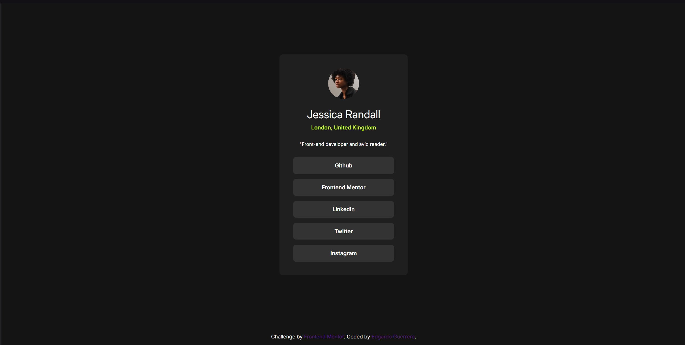

# Frontend Mentor - Solución para Social links profile

Esta es una solución para el [reto de Social links profile en Frontend Mentor](https://www.frontendmentor.io/challenges/social-links-profile-UG32l9m6dQ). Los retos de Frontend Mentor te ayudan a mejorar tus habilidades de programación construyendo proyectos realistas.

## Tabla de contenidos

- [Vista general](#vista-general)
  - [El reto](#el-reto)
  - [Captura de pantalla](#captura-de-pantalla)
  - [Enlaces](#enlaces)
- [Mi proceso](#mi-proceso)
  - [Construido con](#construido-con)
  - [Qué aprendí](#qué-aprendí)
  - [Desarrollo continuo](#desarrollo-continuo)
  - [Colaboración con IA](#colaboración-con-ia)
- [Autor](#autor)

## Vista general

### El reto

Los usuarios deben ser capaces de:

- Ver los estados hover y focus para todos los elementos interactivos de la página.

### Captura de pantalla



### Enlaces

- URL de la solución: [https://github.com/EdgardoGuerrero/frontend-mentor-challenges/tree/main/social-links-profile-main](https://github.com/EdgardoGuerrero/frontend-mentor-challenges/tree/main/social-links-profile-main)
- URL del sitio en vivo: [https://edgardoguerrero.github.io/frontend-mentor-challenges/social-links-profile-main/](https://edgardoguerrero.github.io/frontend-mentor-challenges/social-links-profile-main/)

## Mi proceso

### Construido con

- Maquetación semántica HTML5
- Propiedades personalizadas de CSS (Variables globales)
- Flexbox

### Qué aprendí

En este reto, mi enfoque principal estuvo en la organización y la escalabilidad del código. Implementé por primera vez propiedades personalizadas de CSS (variables) de forma global, asegurando que la paleta de colores y las reglas tipográficas estén unificadas y sean mucho más fáciles de mantener, evitando la repetición de valores en los selectores.

```css
:root {
  --body-bg-color: hsl(0, 0%, 8%);
  --container-bg-color: hsl(0, 0%, 12%);
  --link-bg-color: hsl(0, 0%, 20%);
  --text-color: hsl(0, 0%, 100%);
  --accent-color: hsl(75, 94%, 57%);
  --font-family: "Inter", sans-serif;
}